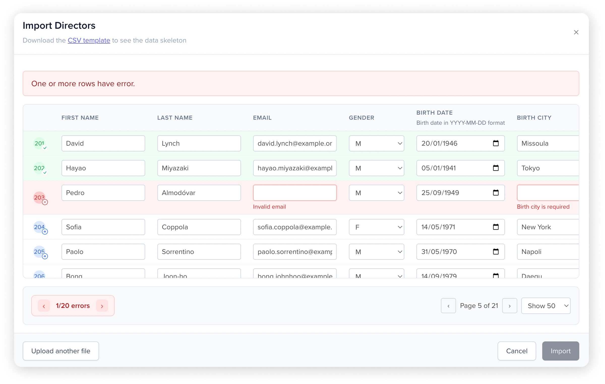

# 🗂️ Vue CSV Importer

**A powerful, user-friendly CSV import component for Vue 3 with live editing, validation, and seamless data processing.**




Transform CSV imports from a painful experience into a delightful one. Built with modern Vue 3, TypeScript, and designed for enterprise applications that need robust data validation and user-friendly editing capabilities.

Brought to you by [](https://www.weroad.com)

## ✨ Key Features

- **📝 Edit imported data on-the-fly** - Users can modify data directly in the import preview.
- **🛡️ Live validation with Zod** - Real-time validation that blocks imports until data is clean.
- **🎯 Schema-inferred editing** - Input types automatically determined from Zod validation schemas.
- **⚡ Large data management** - Handle thousands of rows efficiently with TanStack Table.
- **🌐 Fully translatable** - Complete i18n support for global applications.
- **📱 Responsive design** - Works seamlessly on desktop and mobile devices.
- **♿ Accessible** - Built with accessibility in mind, keyboard navigation and screen readers.
- **🎨 Customizable** - Flexible styling and configuration options.

## 📦 Installation

```bash
# npm
npm install @weroad/vue-csv-importer

# yarn
yarn add @weroad/vue-csv-importer

# pnpm
pnpm add @weroad/vue-csv-importer
```

## 🚀 Usage

### Schema definition

Define your CSV columns with validation schemas using Zod. The columns are needed to create a proper table.  

The Zod validation will be used to define the input types, e.g. for Enums a select will be displayed, for dates a Datepicker. If you don't wish to duplicate the validation logic between your frontend and backend you can just use `z.string().optional()` as schema to show text inputs with no validation and then parse the backend errors.

```typescript
import { z } from 'zod'
import type { CsvImporterColumn } from '@weroad/vue-csv-importer'

const csvColumns: CsvImporterColumn[] = [
  {
    key: 'firstName',
    label: 'First Name',
    schema: z.string().min(1, 'First name is required').max(255, 'First name cannot exceed 255 characters'),
  },
  {
    key: 'email',
    label: 'Email',
    schema: z.email('Invalid email').max(255, 'Email cannot exceed 255 characters'),
  },
  {
    key: 'age',
    label: 'Age',
    schema: z.number().min(18, 'Must be at least 18 years old').max(120, 'Invalid age'),
  },
  {
    key: 'country',
    label: 'Country',
    schema: z.enum(['US', 'CA', 'UK', 'FR'], 'Country is required'),
  },
  {
    key: 'phoneNumber',
    label: 'Phone Number',
    schema: z.string().max(255, 'Phone number cannot exceed 255 characters').optional(),
    hint: 'Optional field with international format'
  }
]

// Extract full Zod schema from column definitions
const importSchema = z.object(
  Object.fromEntries(
    csvColumns.map(column => [column.key, column.schema])
  )
)

// Infer TypeScript type from schema
type ImportData = z.infer<typeof importSchema>
```

**Column Properties:**
- `key`: Unique identifier for the column (matches CSV header)
- `label`: Display name shown in the table header
- `schema`: Zod validation schema for the column
- `hint` (optional): Helper text displayed below the input field
- `width` (optional): Custom column width (e.g., '100px', '20%')

#### Line-by-Line Upload

Process rows individually with granular error handling:

```typescript
const isSubmitting = ref(false)

const handleLineByLineUpload = async ({
  progressBar,
  getUnprocessedRows,
  markRowAsProcessed,
  addRowError,
  fail
}: CsvImporterSubmitData) => {
  isSubmitting.value = true
  progressBar.start()
  
  try {
    const unprocessedRows = getUnprocessedRows()
    
    for (const row of unprocessedRows) {
      try {
        // Upload individual row
        const response = await fetch('/api/users', {
          method: 'POST',
          headers: { 'Content-Type': 'application/json' },
          body: JSON.stringify(row.data)
        })
        
        if (response.ok) {
          // ✅ Mark this row as successfully processed
          markRowAsProcessed(row.index)
          progressBar.advance()
        } else {
          const error = await response.json()
          
          // ❌ Add specific error to this row
          if (error.field) {
            // Error for specific column
            addRowError(row.index, error.field, error.message)
          }
        }
      } catch (error) {
        fail(`Upload failed: ${error.message}`)
      }
    }
    
    progressBar.finish()
    
    // Check if any rows still need processing
    const remainingRows = getUnprocessedRows()
    if (remainingRows.length === 0) {
      console.log('🎉 All rows processed successfully!')
    } else {
      console.log(`⚠️ ${remainingRows.length} rows still have errors`)
    }
  } finally {
    isSubmitting.value = false
  }
}
```

#### File Upload

Upload all data at once to your API:

```typescript
const isSubmitting = ref(false)

const handleFileUpload = async ({
  getUnprocessedFile,
  progressBar,
  fail
}: CsvImporterSubmitData) => {
  isSubmitting.value = true
  progressBar.start()
  
  try {
    const formData = new FormData()
    formData.append('file', getUnprocessedFile())

    const response = await fetch('/api/users/import', {
      method: 'POST',
      body: formData,
    })
    
    if (!response.ok) {
      fail(`Upload failed: ${response.statusText}`)
      return
    }
    
    progressBar.finish()
    console.log('✅ All users uploaded successfully!')
    
  } catch (error) {
    // Network or connection error
    fail(`Failed to upload users: ${error.message}`)
  } finally {
    isSubmitting.value = false
  }
}
```

### All together

You can see here a live demo of the result.

```vue
<template>
  <CsvImporterModal
    :is-open="open"
    :is-submitting="isSubmitting"
    :columns="csvColumns"
    title="Import Coordinators"
    @close="() => emit('close')"
    @submit="handleCsvImportSubmit"
  >
    <template #subtitle>
      Download the <a href="/csv-example.csv" target="_blank" class="tw-text-highlights tw-underline">CSV template</a> to see the data skeleton
    </template>
  </CsvImporterModal>
</template>

<script setup lang="ts">
import { z } from 'zod'
import { CsvImporterModal } from '@weroad/csv-importer'
import type { CsvImporterColumn, CsvImporterSubmitData } from '@weroad/csv-importer'
import '@weroad/csv-importer/style.css'

// Define columns
const csvColumns: CsvImporterColumn[] = [
  {
    key: 'firstName',
    label: 'First Name',
    schema: z.string().min(1, 'First name is required').max(255, 'First name cannot exceed 255 characters'),
  },
  {
    key: 'email',
    label: 'Email',
    schema: z.email('Invalid email').max(255, 'Email cannot exceed 255 characters'),
  },
  {
    key: 'age',
    label: 'Age',
    schema: z.number().min(18, 'Must be at least 18 years old').max(120, 'Invalid age'),
  },
  {
    key: 'country',
    label: 'Country',
    schema: z.enum(['US', 'CA', 'UK', 'FR'], 'Country is required'),
  },
  {
    key: 'phoneNumber',
    label: 'Phone Number',
    schema: z.string().max(255, 'Phone number cannot exceed 255 characters').optional(),
    hint: 'Optional field with international format'
  }
]

// Extract full Zod schema from column definitions
const importSchema = z.object(
  Object.fromEntries(
    csvColumns.map(column => [column.key, column.schema])
  )
)

// Infer TypeScript type from schema
type ImportData = z.infer<typeof importSchema>

const handleCsvImportSubmit = async (
  { addRowError, getUnprocessedFile, progressBar, fail }: CsvImporterSubmitData<ImportData>
) => {
  isSubmitting.value = true
  progressBar.start()

  const unprocessedRows = getUnprocessedRows()

  for (const row of unprocessedRows) {
    try {
      // Upload individual row
      const response = await fetch('/api/users', {
        method: 'POST',
        headers: { 'Content-Type': 'application/json' },
        body: JSON.stringify(row.data)
      })
      
      if (response.ok) {
        // ✅ Mark this row as successfully processed
        markRowAsProcessed(row.index)
        progressBar.advance()
      } else {
        const error = await response.json()
        
        // ❌ Add specific error to this row
        if (error.field) {
          // Error for specific column
          addRowError(row.index, error.field, error.message)
        }
      }
    } catch (error) {
      fail(`Upload failed: ${error.message}`)
    }
  }

  progressBar.finish()
}
</script>
```

### Submit Handler Deep Dive

The `onSubmit` function receives a `CsvImporterSubmitData` object with powerful methods for handling different upload scenarios:

```typescript
interface CsvImporterSubmitData {
  rawRows: unknown[][]              // Original CSV data as arrays
  parsedRows: T[]                   // Validated data as objects
  progressBar: ProgressBar         // Progress control

  // Error handling
  fail: (message: string) => void // Set a generic error text above the CSV table in a red alert
  addRowError: (row: number, column: string | number, message: string) => void // Add an error to a specific column in a the given row
  
  // Success handling  
  markRowAsProcessed: (rowIndex: number) => void // Once processed, row will become green and won't be longer present into "getUnprocessedRows" / "getUnprocessedFile"
  getUnprocessedRows: () => CsvRow[] // Rows not yet processed
  getUnprocessedFile: () => File   // Get a "File" instance with CSV of the unprocessed rows
}
```

#### Managing Submission State

Always manage the `isSubmitting` prop to prevent user interaction during processing:

```typescript
const isSubmitting = ref(false)

const handleSubmit = async (data: CsvImporterSubmitData) => {
  // 1. Set submitting state FIRST
  isSubmitting.value = true
  
  try {
    // 2. Your async processing here
    await processData(data)
  } finally {
    // 3. Always reset state in finally block
    isSubmitting.value = false
  }
}
```

**What `isSubmitting` does:**
- ✅ **Disables submit button** - Prevents multiple submissions
- ✅ **Shows "Importing..." text** - Clear user feedback
- ✅ **Disables all table inputs** - Prevents editing during upload
- ✅ **Prevents modal closure** - User can't close during processing
- ✅ **Maintains data integrity** - No conflicting state changes

#### Mixed Strategy with Retry Logic

Combine bulk upload with individual retry for failed rows:

```typescript
const handleSmartUpload = async ({
  progressBar,
  getUnprocessedRows,
  addRowError,
  markRowAsProcessed,
  fail
}: CsvImporterSubmitData) => {
  isSubmitting.value = true
  progressBar.start()
  
  try {
    // First, try bulk upload
    const response = await fetch('/api/users/bulk', {
      method: 'POST',
      body: JSON.stringify({ users: getUnprocessedRows() })
    })

    if (response.ok) {
      // All succeeded
      progressBar.finish()
      return
    }
    
    // Bulk failed, try individual rows
    const errorData = await response.json()

    if (errorData.failedRows) {
      // Server told us which specific rows failed
      errorData.failedRows.forEach(failure => {
        addRowError(failure.row, failure.column, failure.message)
      })
      
      // Mark successful rows as processed
      parsedRows.forEach((_, index) => {
        const hasFailed = errorData.failedRows.some(f => f.row === index)
        if (!hasFailed) {
          markRowAsProcessed(index)
        }
      })
    }
    
  } catch (error) {
    // Network or connection error
    fail(`Server error: ${error.message}`)
  } finally {
    progressBar.finish()
    isSubmitting.value = false
  }
}
```

#### Error Handling Examples

**Important**: Always use `fail()` for API/business logic errors instead of throwing exceptions. Use try/catch only for network/connection errors.

```typescript
// ✅ Correct - Use fail() for API errors
if (!response.ok) {
  fail(`Upload failed: ${response.statusText}`)
  return
}

// ❌ Wrong - Don't throw for API errors  
if (!response.ok) {
  throw new Error('Upload failed')  // This won't display properly
}

// ✅ Correct - Use try/catch for network errors
try {
  const response = await fetch('/api/upload')
} catch (error) {
  fail(`Network error: ${error.message}`)
}
```

```typescript
const handleWithAdvancedErrors = async ({
  parsedRows,
  getUnprocessedRows,
  markRowAsProcessed,
  addRowError,
  fail
}: CsvImporterSubmitData) => {
  isSubmitting.value = true
  
  try {
    // General error - stops all processing
    if (parsedRows.length > 10000) {
      fail('Too many rows. Maximum 10,000 rows allowed.')
      return
    }

    for (const row of getUnprocessedRows()) {
      try {
        const response = await uploadUser(row.data)
        
        if (response.success) {
          markRowAsProcessed(row.index)
          
        } else {
          // Different error types
          response.errors.forEach(error => {
            switch (error.type) {
              case 'validation':
                // Field-specific error
                addRowError(row.index, error.field, error.message)
                break
                
              case 'duplicate':
                // Row-level error (no specific field)
                addRowError(row.index, 0, `Duplicate user: ${error.message}`)
                break
                
              case 'permission':
                // Row-level error with context
                addRowError(row.index, 'email', 'No permission to create user in this domain')
                break
            }
          })
        }
        
      } catch (error) {
        // Network/server error
        addRowError(row.index, 0, `Server error: ${error.message}`)
      }
    }
  } finally {
    isSubmitting.value = false
  }
}
```

#### Progress Bar Control

```typescript
const handleWithProgress = async ({
  getUnprocessedRows,
  progressBar,
  markRowAsProcessed,
  addRowError
}: CsvImporterSubmitData) => {
  isSubmitting.value = true
  
  try {
    const rows = getUnprocessedRows()
    
    // Start progress bar
    progressBar.start()
    
    for (let i = 0; i < rows.length; i++) {
      const row = rows[i]
      
      try {
        await uploadUser(row.data)
        markRowAsProcessed(row.index)
        
        // Advance progress (automatic calculation)
        progressBar.advance()
        
        // Or advance by specific amount
        // progressBar.advance(1)
        
      } catch (error) {
        addRowError(row.index, 0, error.message)
        // Still advance progress even on error
        progressBar.advance()
      }
    }
    
    // Complete progress bar
    await progressBar.finish()
  } finally {
    isSubmitting.value = false
  }
}
```

## ⚙️ Configuration

### Component Props

| Prop | Type | Default | Description |
|------|------|---------|-------------|
| `isOpen` | `boolean` | `false` | Controls modal visibility |
| `isSubmitting` | `boolean` | `false` | Controls submit button state and input disable during processing |
| `columns` | `CsvImporterColumn[]` | `[]` | Column definitions with validation |
| `title` | `string` | `'CSV Import'` | Modal title |
| `labels` | `object` | `{}` | Custom label overrides |
| `csvParser` | `object` | `{}` | PapaParse configuration |

### Column Configuration

```typescript
interface CsvImporterColumn {
  key: string                    // Unique identifier
  label: string                  // Display name
  schema: ZodType               // Zod validation schema (required inferred from schema)
  hint?: string                 // Help text for users
  width?: number | string       // Column width (e.g., 200 or '15rem')
}
```

## 🌐 Internationalization

The package uses a **vue-i18n**-like syntax (less powerful) for [variables interpolation](https://vue-i18n.intlify.dev/guide/essentials/syntax.html) and [pluralization](https://vue-i18n.intlify.dev/guide/essentials/pluralization).

### Plugin Configuration (Recommended)

This will override the configuration on global scale, so you don't have to repeat them in every component usage.

```typescript
// main.ts or plugins/csv-importer.ts
import { createApp } from 'vue'
import { createCsvImporter } from '@weroad/vue-csv-importer'

const app = createApp(App)

app.use(createCsvImporter({
  labels: {
    title: 'Importar CSV',
    submitButton: 'Importar', 
    cancelButton: 'Cancelar',
    uploadButton: 'Seleccionar archivo CSV',
    noFileSelected: 'Ningún archivo seleccionado',
    rowsHaveErrors: 'Una o más filas tienen errores.',
    paginationPageOf: 'Página {current} de {total}',
    paginationShowSize: 'Mostrar {size}',
    errorNavigation: '{current}/{total} {word}',
    errorWord: 'error | errores',
    // ... more labels
  }
}))
```

### Component-Level Translation

```vue
<template>
  <CsvImporter
    :is-open="showImporter"
    :columns="columns"
    :labels="spanishLabels"
    :on-close="() => showImporter = false"
    :on-submit="handleSubmit"
  />
  </template>

<script setup lang="ts">
const spanishLabels = {
  title: 'Importar CSV',
  submitButton: 'Importar',
  cancelButton: 'Cancelar',
  uploadButton: 'Seleccionar archivo CSV',
  missingColumnsTitle: 'Faltan las siguientes columnas:',
  columnCountMismatchTitle: 'El CSV tiene un número inesperado de columnas',
  rowsHaveErrors: 'Una o más filas tienen errores.',
  paginationPageOf: 'Página {current} de {total}',
  errorNavigation: '{current}/{total} {word}',
  errorWord: 'error | errores'
}
</script>
```

### Complete Translation Keys

```typescript
interface Labels {
  // General
  title: string
  submitButton: string
  submitButtonProcessing: string
  cancelButton: string
  closeButton: string
  reuploadButton: string
  
  // Upload
  uploadButton: string
  noFileSelected: string
  
  // Validation
  missingColumnsTitle: string
  columnCountMismatchTitle: string
  rowsHaveErrors: string
  
  // Navigation
  paginationPageOf: string        // 'Page {current} of {total}'
  paginationShowSize: string      // 'Show {size}'
  errorNavigation: string         // '{current}/{total} {word}'
  errorWord: string              // 'error | errors' (with pluralization)
  
  // Tooltips
  rowTooltipReady: string
  rowTooltipError: string  
  rowTooltipProcessed: string
}
```

## 🎨 Styling

The component comes with a default Tailwind CSS-based design that's fully customizable, just navigate through the elements with your inspector and customize them.

```css
/* Override default styles */
.csvi-modal {
  /* Customize modal appearance */
}

.csvi-table {
  /* Customize table styling */
}

.csvi-error-nav {
  /* Customize error navigation */
}
```

## 📝 Events

| Event | Payload | Description |
|-------|---------|-------------|
| `@close` | `void` | Emitted when modal is closed |
| `@submit` | `data: CsvImporterSubmitData` | Emitted when user submits validated data |

## 📄 License

MIT License - see [LICENSE](LICENSE) file for details.

## 🙏 Acknowledgments

- Built with [Vue 3](https://vuejs.org/)
- Powered by [TanStack Table](https://tanstack.com/table)
- Validation by [Zod](https://zod.dev/)
- CSV parsing with [PapaParse](https://www.papaparse.com/)

---

Made with ❤️ by [](https://www.weroad.com)